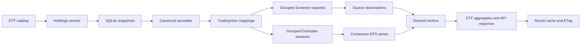

# Architecture and data contracts

This document contains the durable technical decisions behind IndexLens. It
describes current behaviour, not implementation history or a work plan.

## Request flow



API handlers validate HTTP input and delegate to services. Services coordinate
providers and repositories. Domain processors contain calculations that are
independent of persistence and the interface.

The Metrics Overview pipeline is split by responsibility:

- `metrics-overview-service.ts` validates, orchestrates, and assembles results.
- `metrics-overview-screener.ts` resolves symbols and refreshes fundamentals.
- `metrics-overview-estimates.ts` refreshes and persists consensus series.
- `metrics-overview-model.ts` builds ETF aggregates, chart points, and the DTO.

## Holdings and security identity

BlackRock product data is preferred because it includes ISIN, SEDOL, and CUSIP;
the regional iShares CSV is the fallback. A successful HTTP response is still
rejected when its holdings payload is implausibly short. ACWI requires at least
2,000 rows, CSEMAS requires 500, and smaller universes use a five-row minimum.
Each rejected candidate advances to the next official source.

CSEMAS (`csemas-ucits`) is a native MSCI Emerging Markets Asia universe with
its own SIX/USD source and snapshot. It does not alias another ETF's holdings.

Canonical identity uses ISIN, then SEDOL, CUSIP, and finally a conservative
name-and-ticker fallback. Legacy identities are reconciled transactionally
during ingestion only when the target is unambiguous. Related holdings,
provider mappings, metrics, prices, and portfolio positions move together.

Only positive-weight equity holdings participate in constituent metrics.
Holdings snapshots in SQLite are the sole holdings cache. After the configured
TTL, providers are requested with `no-store`; when refresh fails, the latest
snapshot remains available as stale data. A `503` is returned only when no
snapshot has ever been stored.

## Provider mappings

A usable TradingView mapping has provider `tradingview`, status `resolved`, a
non-empty compatible provider symbol, and auditable provenance:
`exact_exchange`, `confirmed_alias`, `country_fallback`, or `cross_exchange`.
The resolver retains exchange, provider description, candidates, name score,
and issuer checks. Numeric coverage alone does not make a mapping trustworthy.

European Euronext labels resolve to `EURONEXT:` before the generic `NYSE:`
fallback. Confirmed exchange-specific aliases and normalized HKEX numeric
tickers are accepted only after provider verification. Ambiguous country
fallbacks remain unresolved.

Current Screener and Estimates observations are usable only when their provider
symbol matches the current mapping. A mapping change invalidates incompatible
derived values until matching observations arrive.

## Fundamentals and consensus estimates

TradingView Screener fields are requested in grouped batches. A field missing
from a successful response creates a temporary, field-level negative-cache
entry, hides any older value for the current result, and lowers coverage. A
failed batch never creates a missing entry; a compatible stored value may be
used as stale fallback.

Each valid EPS consensus series contains exactly eight unique, finite points:
the four estimates associated with the latest reported quarters and the next
four quarterly estimates. It also requires a positive price, currency, and
provider symbol. Reported or reconstructed EPS values are never substituted.

The bounded in-memory negative cache has separate instances for Screener fields
and EPS series. SQLite table `provider_negative_cache` persists only confirmed
absences across restarts. Entries expire, are pruned during bootstrap, and are
deleted when data becomes available again. Transport failures are never stored
as absences.

## Source status

| Status | Meaning | Displayed data |
| --- | --- | --- |
| `live` | Fresh and complete provider response | Fresh result |
| `cached` | Compatible caches are complete; no provider call is needed | Persisted result |
| `partial` | A symbol, field, or series is confirmed missing | Reduced coverage with a warning |
| `stale` | A refresh failed or holdings expired | Latest compatible fallback, if any |

Typed warnings distinguish stale holdings, unresolved mappings, incomplete
Screener data, and incomplete Estimates data. `stale` takes precedence when a
response contains both confirmed gaps and a real provider failure.

## Aggregation rules

- Consensus P/E, P/E TTM, P/B, P/S, EV/EBITDA, and P/FCF use a
  holding-weighted harmonic mean over positive covered ratios.
- Operating margin, ROIC, revenue growth, diluted EPS growth, yield, ROE,
  debt/equity, and beta use an arithmetic mean over covered holding weight.
- Market capitalisation uses a holding-weighted median.
- Estimate-driven ETF growth compares aggregate earnings yields for components
  with positive historical and forward P/E values:

```text
sum(weight / PE_forward) / sum(weight / PE_historical) - 1
```

Missing or non-positive endpoints reduce coverage; they are never treated as
zero growth. Each aggregate exposes coverage and the oldest/latest capture
window of its contributing observations.

The constituent chart uses fixed Q-3-to-next-quarter measures, independent of
the 4Q/2Q/1Q roll-down selector. Its x-axis is
`P/E Q-3 / P/E next quarter - 1`; its y-axis is next-quarter P/E. Selected ETFs
are fixed-size squares. Constituents with incomplete endpoints, non-positive
P/E, or positions beyond the top 500 are counted separately. Robust 5th–95th
percentile axes are bounded by IQR fences; excluded visual outliers remain in
the data and the full range can be displayed.

The `/api/v1` DTO retains `securityId`, `providerSymbol`, historical and forward
EPS sums, and complete `estimatePoints`. Existing fields may be nullable but
must not be silently removed or compacted without a new API version.

## Persistence and HTTP caching

Core tables include holdings snapshots, holdings, securities, provider symbols,
metric definitions, metric observations, portfolios, local ETFs, and the
provider negative cache. Writes are transactional and large metric operations
are batched.

The bounded Metrics Overview result cache holds up to eight selections.
Confirmed partial results may be cached briefly; HTTP caching must not turn a
stale fallback into durable data. The response is serialized once and its ETag
is computed from those exact bytes, so any field, order, counter, or warning
change produces a new `200` response instead of `304`.

Two measured hot paths—latest numeric metrics and EPS series—use parameterized
SQL followed by TypeScript reconstruction and validation. Other database access
uses Drizzle. This exception should not be expanded without profiling.

The supported runtime is one Next.js standalone process with durable SQLite
outside `.next`. A distributed cache and multi-instance write coordination are
outside the current design.

## Change requirements

Changes to provider identity, missing-versus-failed semantics, aggregation
formulas, source status, ETag construction, or the v1 DTO require focused tests.
Run the standard test, typecheck, lint, mapping audit, and production build
before release. Performance changes must be justified by an end-to-end profile;
past micro-optimisations are not active documentation and remain available in
Git history.
