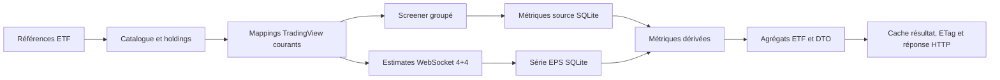

# Architecture courante de Metrics Overview

Ce document décrit le comportement réellement exécuté. Les correctifs restants
sont définis dans le [plan final dirigé](iterative-agent-work-plan.md) et les
preuves historiques utiles dans le [bilan d’ingénierie](engineering-review.md).

## Flux d’une requête



Responsabilités :

- `metrics-overview-service.ts` valide, orchestre et assemble le résultat ;
- `metrics-overview-screener.ts` gère candidats, résolution, couverture et
  persistance des fondamentaux ;
- `metrics-overview-estimates.ts` gère la série consensus, ses absences et sa
  persistance ;
- `metrics-overview-model.ts` construit les points graphiques et le DTO ETF.

## Holdings et identité

- Seuls les holdings actions de poids positif sont éligibles.
- Le provider iShares rejette un HTTP 200 qui ne contient pas de lignes de
  holdings plausibles.
- BlackRock product-data est prioritaire lorsqu’il est disponible, car il
  expose ISIN, SEDOL et CUSIP. Le CSV régional reste la source suivante.
- Chaque candidat est contrôlé avec le seuil de plausibilité propre à l’ETF ;
  un payload trop court passe réellement au candidat suivant au lieu d’être
  retéléchargé une seconde fois. ACWI exige au moins 2 000 lignes et le nouvel
  univers natif CSEMAS au moins 500 ; les petits ETF conservent le plancher
  générique de cinq lignes.
- CSEMAS (`csemas-ucits`) représente directement le MSCI Emerging Markets Asia :
  sa cotation SIX en USD garde son propre flux BlackRock/iShares et son propre
  snapshot, sans réutiliser les holdings d’un autre ETF.
- Le snapshot SQLite est l’unique cache de holdings. Après expiration de son
  TTL, BlackRock/iShares est appelé avec `no-store` afin qu’une réponse périmée
  du cache de revalidation Next.js ne puisse pas renouveler `fetchedAt`.
- L’identité canonique suit ISIN, SEDOL, CUSIP, puis un secours nom+ticker. Les
  références historiques sont réconciliées transactionnellement à l’ingestion.
- Le hash `ishares-holdings-v3:` force une relecture contrôlée des snapshots
  créés avant cette normalisation.

Un mapping TradingView courant exige :

- `provider = 'tradingview'` ;
- `status = 'resolved'` ;
- un `provider_symbol` non vide ;
- un symbole compatible avec les candidats actuels ;
- une provenance auditable : `exact_exchange`, `confirmed_alias`,
  `country_fallback` ou `cross_exchange`.

Une couverture numérique de 100 % ne suffit pas. L’audit contrôle aussi pays,
exchange, émetteur, alternatives, métadonnées et poids.

## Données Screener

Le Screener TradingView reçoit des symboles `EXCHANGE:TICKER` en lots. Les
familles source couvrent notamment P/E TTM, P/B, P/S, EV/EBITDA, P/FCF,
marge opérationnelle, ROIC, croissance du chiffre d’affaires et de l’EPS dilué,
capitalisation, rendement, ROE, dette/equity et bêta.

Un champ absent d’une réponse réussie :

1. n’écrit pas une ligne `NULL` qui masquerait une ancienne valeur numérique ;
2. crée une absence négative temporaire pour ce symbole et ce champ ;
3. masque la valeur concernée dans le résultat courant ;
4. produit une couverture `partial` explicite.

Un lot en échec ne crée aucune absence négative. Une valeur persistée compatible
peut être utilisée comme fallback `stale`.

## Série EPS Estimates

`security:eps_estimate_series:v1` contient exactement huit points valides :

- quatre estimations historiques associées aux derniers trimestres publiés ;
- quatre consensus trimestriels futurs.

Chaque point doit avoir une période unique, une estimation finie et un booléen
`IsReported` explicite. La série doit également fournir prix positif, devise et
symbole provider. Les EPS effectivement publiés ne participent à aucun calcul.

Une série mise en cache devient immédiatement incompatible si le mapping
TradingView change. Les métriques dérivées P/E et croissance sont alors retirées
jusqu’à réception d’une série valide pour la nouvelle identité.

## États de source

| État | Condition | Donnée affichée |
| --- | --- | --- |
| `live` | donnée fraîche reçue, aucune lacune | résultat frais |
| `cached` | aucun appel nécessaire, caches complets et compatibles | résultat persisté |
| `partial` | absence de symbole, champ ou série confirmée | valeur absente et couverture réduite |
| `stale` | erreur de transport ou holdings anciens | dernier fallback compatible, s’il existe |

Les warnings typés précisent holdings stale, mapping non résolu, Screener
partiel/indisponible et Estimates partiel/indisponible. `stale` a priorité sur
`partial` lorsqu’une même réponse combine absence confirmée et panne réelle.

## Agrégations actuelles

- P/E consensus, P/E TTM, P/B, P/S, EV/EBITDA et P/FCF : moyenne harmonique
  pondérée sur les ratios positifs.
- Marge opérationnelle, ROIC, croissance du chiffre d’affaires, croissance de
  l’EPS dilué, rendement, ROE, dette/equity et bêta : moyenne arithmétique
  pondérée sur le poids couvert.
- Capitalisation : médiane pondérée par le poids des holdings couverts.
- Croissance EPS estimée : croissance des earnings yields agrégés sur les
  composants ayant des P/E historique et forward positifs.
- Croissance EPS Q-3 vers prochain trimestre : transformation directe des deux
  P/E ETF du roll-down 1Q, soit
  `(P/E ETF Q-3 / P/E ETF prochain trimestre) - 1`. La couverture propre à
  chaque extrémité reste affichée.

La formule exécutée est :

```text
Σ(poids / PE_forward) / Σ(poids / PE_historique) - 1
```

Les composants sans l’un des deux P/E positifs réduisent la couverture de cet
agrégat ; ils ne sont pas transformés en croissance nulle. Chaque métrique ETF
porte également la fenêtre `oldest`/`latest` des observations qui contribuent à
sa valeur. Le DTO expose séparément les fenêtres globales fondamentaux et
consensus, afin de ne pas confondre l’heure du calcul avec l’âge des sources.

## Bubble chart et DTO

Le graphique unique ETF + constituants utilise deux mesures fixes, indépendantes
du sélecteur de roll-down :

- poids original du holding ;
- croissance EPS implicite entre le P/E annualisé Q-3 et celui du prochain trimestre ;
- P/E calculé sur le consensus EPS du prochain trimestre annualisé ×4 ;
- prix, devise et huit estimations compactes.

Les ETF sélectionnés sont superposés sous forme de petits carrés de taille fixe
sur les mêmes axes. Chaque carré reprend une teinte légèrement éclaircie de la
couleur dédiée à son ETF, sans réutiliser l’échelle de taille des constituants.
Leur croissance transforme directement les deux P/E ETF du roll-down 1Q,
et leur P/E vertical est la moyenne harmonique pondérée du P/E prochain trimestre.
Le sélecteur 4Q/2Q/1Q ne modifie
que le graphique de roll-down ; la carte à bulles et les tableaux restent fixes.

Le DTO courant conserve les champs de la réponse v1 publiée : identité
`securityId`/`providerSymbol`, sommes historique/forward et `estimatePoints`
complets. Les anciens champs de valorisation 4Q restent présents mais peuvent
être `null` : ils ne conditionnent plus l’éligibilité de la nouvelle carte.
Les compteurs transparents (`eligibleHoldingCount`,
`missingMetricCount`, `excludedNonPositivePeCount` et `truncatedCount`) sont
ajoutés sans supprimer `eligibleCount` ni `excludedOutlierCount`.

Sont comptés séparément : séries/métriques manquantes, P/E Q-3 ou prochain
trimestre non positif et titres au-delà du top-500. Le graphique charge d’abord les plus grandes
positions, mais permet d’afficher tout l’univers disponible. Par défaut, ses
axes robustes utilisent les quantiles 5–95 % bornés par les fences IQR ; les
points hors cadre sont listés et restent dans les données. L’utilisateur peut
basculer vers l’étendue complète. Une marge SVG de 24 px réserve les libellés
sans comprimer excessivement la zone centrale.

La compaction précédente par `estimatePeriods`/`estimates` a été retirée du
contrat `/api/v1` : elle réduisait le payload mais supprimait des champs déjà
publiés. Le test `metrics-overview-model.test.ts` verrouille désormais les
champs v1 et les nouveaux compteurs.

## Persistance et caches

Tables principales :

- `holding_snapshots`, `holdings`, `securities` ;
- `security_provider_symbols` ;
- `metric_definitions`, `metric_observations` ;
- `provider_negative_cache`.

Le cache négatif est une seule abstraction bornée, avec deux instances : séries
EPS et champs Screener. La table SQLite, indexée par provider, type, symbole et
métrique, n’est que sa persistance entre redémarrages. Seules les absences
confirmées y sont écrites ; une valeur revenue supprime sa clé.

Le cache résultat Metrics Overview est borné à huit sélections. Les données
`partial` peuvent être réutilisées brièvement car leurs absences sont déjà
explicites ; les données `stale` ne doivent pas être rendues durables par le
cache HTTP.

La réponse HTTP sérialise une seule fois `{ data: result }`. Son ETag est le
hash de cette chaîne exacte : toute différence de champ, compteur, ordre ou
warning invalide le validateur et produit une nouvelle réponse `200`.

Le runtime cible reste Next.js standalone, SQLite durable hors `.next` et une
seule instance applicative. Un cache distribué est hors périmètre.

## Migrations et lectures chaudes

- `0006` ajoute l’index de lecture des observations récentes ;
- `0007` et `0008` retirent les séries EPS dérivées invalides ;
- `0009` retire les anciennes définitions métriques ;
- `0010` ajoute le cache négatif persistant.

Les nouvelles définitions Screener et leurs méthodes d’agrégation sont seedées
idempotemment ; elles ne nécessitent pas une table supplémentaire.

Les lectures chaudes des métriques numériques et des séries EPS utilisent du
SQL paramétré direct, avec reconstruction et validation en TypeScript. Les
autres accès restent sous Drizzle. Cette exception est limitée aux deux chemins
dont le gain a été mesuré.

## Validation et limites

L’instrumentation temporaire par phases a été retirée après les mesures : elle
ajoutait une interface et des compteurs provider au chemin courant sans modifier
le produit. Les futurs profils doivent être ponctuels et guidés par une mesure.

L’audit strict contrôle les mappings résolus, leur provenance, les incohérences
entre mapping, Screener et Estimates, les doublons d’identité et les références
orphelines. Les volumes exacts restent propres à la base auditée ; la couverture
par métrique est affichée séparément dans le panel.

La date de validation courante et les résultats de la suite complète sont
consignés dans le [bilan d’ingénierie](engineering-review.md). Un éventuel
`spawn EPERM` doit être confirmé hors sandbox avant d’être attribué au projet.
